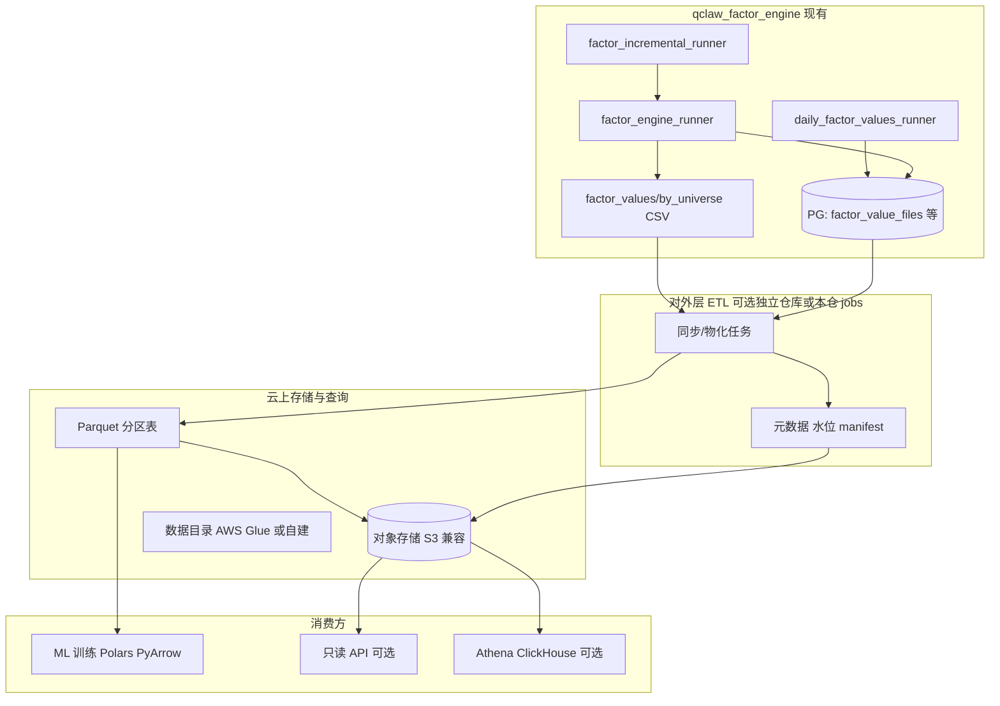

# 因子值对外服务 — 详细设计架构与方案

> **版本**：v1（2026-04-26）  
> **范围**：在 **qclaw_factor_engine** 现有「真分域 CSV + `factor_value_files` 索引 + 月增量 v1」之上，为 **外部队列（ML/深度学习 训练/预测）** 提供 **大批量、可发现、可复现、总含最新** 的因子值读取面；**上云**（对象存储为主）。  
> **非目标**：本文不替代《因子值增量方案_v1》的批次语义；不强制改造策略工厂现有默认读 `ALL` 的路径（见《因子侧真分域因子值_设计与落地步骤》策略侧约定）。

---

## 1. 目标与成功标准

| 目标 | 说明 |
|------|------|
| **全因子** | 以工厂内已解析/已发布的因子为主；因子会持续增加，**存储形态需支持增加因子不破坏历史产物**。 |
| **多域** | 与现网一致：按 **HS300 / ZZ500 / ALL** 等 **单独产出** 因子值；**消费侧按域只扫本域数据**。 |
| **长历史** | 约 2015 年至今；与 **月增量 + 季度 rebase** 叠加后，与《因子值增量方案_v1》的 **区间拼接、优先级** 一致。 |
| **大量读取** | 训练/特征工程以 **列式、分区、并行** 为主；避免「逐因子打开数百个 CSV」作为对外主路径。 |
| **始终最新** | 对外可查询 **每域、每类产物** 的 **最新可用交易日 / 数据水位**；与 DB 中 `stage=production` 的发布策略对齐。 |
| **可复现** | 任一次外发训练能记录 **`factor_set` + 批次/水位 + 代码/配方版本**（与现有 `batch_id` / `is_rebase` 可衔接）。 |

**验收（建议）**

- 给定 `universe` 与 `date_start/end`，能在 **不加载无关域、无关日期分区** 的前提下拉取全量特征矩阵或长表。  
- 新因子上架后，**老分区不必重写**；新因子从有效起始日出现在 **新增分区或新列**（按选定物理模型）。  
- 水位文件 / 表与 `factor_value_files` 中 **production 批量** 的 `date_end` 可交叉校验。

---

## 2. 现状基线（与仓库实现一致）

以下摘自当前代码与文档，作为方案设计的 **事实输入**；对外层 **叠加** 而非替代。

### 2.1 落盘路径（批量因子值）

- **根约定**：`factor_values/by_universe/{UNIVERSE}/`（**ALL 也在 `by_universe/ALL/`**）。  
- **文件名**：`{factor_id}_{UNIVERSE}_{publish_start_date}_{end_date}.csv`（见 `src/factor_engine/factor_engine_runner.py` 中 `output_dir` / `csv_name` 构造）。  
- **列结构**：`trade_date, stock_code, factor_value`（经 `winsorize_and_standardize` 后的逐票长表；与引擎导出逻辑一致）。  
- **分域实现**：`universe != ALL` 时，在 `_load_stock_daily` **SQL 侧按股票池过滤**，与真分域设计文档一致，避免全市场进内存。

### 2.2 元数据表 `factor_value_files`

- **权威用途**：真分域因子值路径索引；`artifact_type` 含 **`batch_csv`（批量大区间）**、**`daily_csv`（日更）** 等。  
- **关键字段**（与引擎写入一致）：`factor_id`, `universe`, `rel_path`, `date_start`, `date_end`, `batch_id`, `stage`, `is_rebase`, `created_at`, …  
- **策略/工厂侧取批量路径**：`src/common/factor_value_files_batch.py` 的 `load_batch_csv_rel_paths`：按 `universe` + `batch_csv`，对每因子 `DISTINCT ON (factor_id) ORDER BY created_at DESC, id DESC` 取**当前主路径**（与《因子值增量方案_v1》中「多文件需按区间+优先级拼接」的 **完整训练读法** 相比，此处为 **单条最新** 的简化版——训练侧若已按 v1 实现拼接，对外服务层应 **继承 v1 的区间合并规则**）。

### 2.3 增量编排

- **入口**：`src/factor_incremental/factor_incremental_runner.py`：  
  - `incremental`：从 `factor_value_files` 中主链 `stage in (candidate, production)` 的 `batch_csv` 最大 `date_end` 的下一自然日，到锚点日；带 **warmup 交易日** 回算。  
  - `rebase`：从配置的 `start_date` 到锚点，标记 `is_rebase`。  
- **写仍走**：`run_factor_engine`（`factor_engine_runner`），**发布区间**由 `publish_start_date_override` 与 `end_date` 控制。

### 2.4 日更线

- **入口**：`src/daily_factor_values/daily_factor_values_runner.py`；登记 **`artifact_type=daily_csv`**。  
- **v1 约定**：《因子值增量方案_v1》中 **训练主数据优先 `batch_csv`**，日更用于执行与对账；对外「最新」可 **用日更 + 批量的合并策略** 单独定义（见 §5.3）。

### 2.5 与 `factor_files.factor_values_path` 的关系

- `factor_files.factor_values_path` 为**兼容列**；可从 `factor_value_files` 同步（`src/backtest_io/sync_factor_values_path_runner.py`）。**对外新系统应以 `factor_value_files` 为索引真源。**

### 2.6 部署形态（参考）

- GitHub Actions 将代码同步至服务器目录（如 `/data/qclaw/qclaw_factor_engine`），依赖 `requirements.txt`；**大文件资产（因子 CSV）** 通常不随每次 rsync 全量重传，**上云对象存储** 与现有服务器目录的对应关系需在运维层明确（§7）。

---

## 3. 差距分析

| 现状 | 外部队列（ML）痛点 |
|------|---------------------|
| 每因子一个或若干 **CSV 文件** | 300+ 因子 × 多域 = **极多小文件**；**冷启动、元数据 N 次、难以列裁剪** |
| 依赖 **拼接** 多区间 `batch_csv`（v1） | 需严格实现 **重叠键优先级**；用文件系统直读时 **易错、难审计** |
| 数据在仓内磁盘路径 | 对外扩展、**地域只读复制、IAM** 用对象存储更顺 |
| `load_batch_csv_rel_paths` 取「每因子一条最新」 | 与 v1 **按训练窗区间合并** 可能不一致，训练代码若未对齐会 **缺段或错段** |

**结论**：**不**把「全量历史因子值**仅**存关系库大宽表」作为唯一方案；**主对外平面** 采用 **对象存储 + 列式 + 分区**，**库/索引** 作 **元数据、水位、权限、批次**；**必要时** 再挂 **OLAP / API**。

---

## 4. 总体架构（逻辑分层）



**原则**

1. **计算真源** 短期仍在现有引擎 + CSV；**对外读优化** 通过 **派生层（Parquet）** 完成，**不**强制在线训练直接打 PG 大表。  
2. **索引真源** 仍用 `factor_value_files` + 增量 v1 规则；**object 上 manifest** 与 DB **对账**（见 §6）。  
3. **分域** 在对象路径第一层体现：`.../universe=ZZ500/...`，与「每域单独产出」一致，**不依赖** 再在文件内过滤域。

---

## 5. 存储与数据模型

### 5.1 推荐主形态：分区的 **列式 Parquet**（ZSTD）

- **建议路径示例**（Hive 风格，可微调）：  
  `s3://{bucket}/qclaw/factor_values_pq/v1/universe=ZZ500/trade_date=2015-01-05/data.parquet`  
  或再按 `year=2015/month=01/` 分桶以降低单 prefix 下文件数。  
- **行级别语义（长表，利于因子增加）**  

  | 列 | 说明 |
  |----|------|
  | `trade_date` | date32 / string |
  | `stock_code` | string，与现 CSV 一致 |
  | `factor_id` | string |
  | `factor_value` | float |
  | `data_source` | 可选：batch / daily，便于合并审计 |

- **按日一分区、每域多 shard**：训练时用 **多进程按 trade_date 列表** 或 **按年并行**，满足「一次性大量读」。

### 5.2 物化 **宽表**（可选、版本化）

- 对某次训练/对外发布，将固定 **`factor_id` 集合** 透视成：  
  `(trade_date, stock_code, f_001, f_002, …)`。  
- **存路径** 与 **`factor_set_version` 或 `batch_tag`** 绑定，例如：  
  `.../matrix/factor_set_2026Q2/universe=HS300/...`  
- **新增因子** 不修改旧 `factor_set` 目录；**新训练** 用新 `factor_set_version`，保证 **可复现**。

### 5.3 「最新」定义（与 v1 衔接）

- **仅批量**：对外水位可取 **每域** `max(date_end)` 且 `stage=production` 的 `batch_csv` 在 `factor_value_files` 中的聚合。  
- **含日更**（若预测要 T-1 与当日日更拼接）：在 manifest 中显式写 **`batch_max_date` + `daily_max_date`** 及 **合并规则**（例如 T 的截面：若 `daily` 存在则覆盖 `batch` 同键）。**需在文档中写死，避免双义性。**

---

## 6. 元数据、水位与对账

### 6.1 每域 `watermark.json`（或 `latest.json`）

建议字段（示例）：

```json
{
  "universe": "ZZ500",
  "as_of_trade_date": "2026-04-25",
  "source": "factor_value_files",
  "batch_production_max_date_end": "2026-04-25",
  "daily_max_trade_date": "2026-04-25",
  "parquet_max_trade_date": "2026-04-25",
  "factor_count_batch": 420,
  "etl_build_id": "pqt_20260426T090500Z",
  "code_git_sha": "optional"
}
```

- **更新时机**：`factor_incremental` 发布 production 后、或 ETL 跑完 object 后 **原子写入**（先临时对象再 rename/覆盖 pointer）。  
- **消费者**：训练脚本**先读 watermark**，再决定 `end_date` 与是否缺段。

### 6.2 与 DB 的交叉校验

- 定时任务对比：`watermark.parquet_max_trade_date` vs `SELECT max(date_end) ... factor_value_files WHERE ...`。  
- 不一致时 **告警、阻断依赖该水位的自动化训练**（与 v1「覆盖不足则失败」精神一致）。

### 6.3 因子目录（`factor_id` 生命周期）

- 建议 **小表** 或同 bucket 的 **`factors_dim.parquet`**：  
  `factor_id, display_name, first_effective_date, added_at, is_valid, ...`  
- 与 `factor_basic` 可定期同步，避免外部队列 **误用** 无历史的新因子全区间。

---

## 7. 同步 ETL 设计（CSV → Parquet）

### 7.1 输入

- **主**：`factor_values/by_universe/{UNIVERSE}/**/*.csv`（或从对象存储的镜像路径读取）。  
- **辅**：`factor_value_files` 中 `batch_id/stage/is_rebase/date_start/date_end`（用于 **v1 区间拼接** 的权威顺序）。  

### 7.2 处理步骤（建议）

1. **按 v1 规则** 对每 `(factor_id, universe)` 生成 **连续时间序列**（`trade_date+stock_code` 去重，**is_rebase 优先**）。  
2. **标准化股票代码、日期类型**，与现 CSV 列名对齐。  
3. **长表** 追加 `factor_id` 列，**union** 多因子。  
4. 写出 **按 trade_date 分区** 的 Parquet，**zstd** 压缩，row group 建议 **单交易日单码表可在一个 row group 内** 便于按日裁剪。  
5. 更新 **该域** `watermark` 与 **ETL 日志**（失败因子列表、行数、耗时）。

### 7.3 调度

- **月增量/ rebase 后**：事件触发 + 全量/增量 ETL（仅新日期分区 or 重算受影响的日分区）。  
- **资源**：与现网 `pipeline_job`、shell 周月任务 **错峰**；大窗 rebase 时 **重跑受影响分区**。

### 7.4 与现有部署目录

- 若生产 CSV 在 `/data/qclaw/.../factor_values/`，ETL 可同机读本地写云；或 **rclone / 内网 sync** 将 CSV 同步到 bucket 再跑 **Serverless/批量任务**，避免在 CI 里拉全量数据。

---

## 8. 消费侧设计

| 方式 | 适用 | 说明 |
|------|------|------|
| **PyArrow / Polars 直读 S3 前缀** | 主力训练 | 按 `trade_date` 过滤、**按列/factor 裁剪**、多进程；与 PyTorch `IterableDataset` 可衔接 |
| **DuckDB 挂 parquet** | 内部分析/少量 SQL | 单进程友好 |
| **Athena / 数据湖** | 想 SQL 且无常驻集群 | 外部表指同一 prefix |
| **只读 API** | 外网合作方/不便给凭证 | 按域/日期段 **预签 URL** 或流式下 manifest + 分片；**不**用 API 传 TB 级全历史 |

**训练清单（manifest）**：输出 `used_universe, date_range, factor_ids, batch_ids, parquet_uri_prefix, code_version` 写入实验跟踪（MLflow 等）。

---

## 9. 安全、合规与成本

- **凭证**：**IAM 角色/STS** 临时密钥；**按域/前缀** 分桶或前缀策略。  
- **公网合作方**：仅 **脱敏/授权域** 的 bucket 或 **预签只读**；不暴露内网 `factor_value_files` 库直连。  
- **成本**：Parquet 列存 + 分区可显著降 **IO 与出口费**；宽表物化**按需**生成，避免重复存多份可派生数据。

---

## 10. 分阶段实施（与现有 P 阶段对齐）

| 阶段 | 内容 | 依赖 |
|------|------|------|
| **P0** | 定稿 **S3 路径规范 + 长表 schema + watermark 字段**；**DB 对账** SQL | 无 |
| **P1** | 实现 **ETL v1**（从现有 CSV 全量/增量刷 Parquet）；文档 **Python 读取示例** | 仓内能访问 bucket |
| **P2** | 训练侧 **按 v1 与 watermark** 接收入口；**监控** 水位 vs DB | P1 |
| **P3** | 可选 **宽表**、`factor_set_version`、**Athena/Glue** | P2 |
| **P4** | 可选 **只读 API**、跨账号复制 | 业务需要 |

---

## 11. 与仓库模块的映射表

| 模块 / 文档 | 在本方案中的角色 |
|-------------|------------------|
| `src/factor_engine/factor_engine_runner.py` | **计算与 CSV 真源** |
| `src/factor_incremental/factor_incremental_runner.py` | **月增量与 rebase 编排** |
| `src/daily_factor_values/daily_factor_values_runner.py` | **日更**；定义「最新」时可选并入 |
| `src/common/factor_value_files_batch.py` | 现有**简化**取路径；对外 ETL 应实现 **v1 全量拼接** |
| `docs/因子值增量方案_v1.md` | **批次、重叠、rebase 优先级** — ETL/训练**必须**一致 |
| `docs/complete/db_conventions.md` | 表职责边界；**`factor_value_files` 为权威** |
| `docs/complete/因子侧真分域因子值_设计与落地步骤.md` | 路径与真分域语义 |
| 新建 ETL 作业 | 建议独立脚本或子包，如 `src/factor_export_pq/`（实施时定名） |

---

## 12. 风险与缓解

| 风险 | 缓解 |
|------|------|
| 拼接逻辑与 v1 不一致 | **单处库** 实现 v1 合并；单元测试 + 对账行数/日期断档 |
| 新因子历史短，训练误用 | **`factors_dim` + 训练前校验** 区间交集 |
| 多域成分变化导致前视 | 对外文档声明 **PIT 成分** vs **当前域标签** 口径；与现引擎 mask 来源一致 |
| 存储重复（每域全存） | 可接受以换 **读路径极简化**；后续再评估共享因子层 |

---

## 13. 参考与修订

- 本文与下列文档**协同阅读**：  
  - `docs/因子值增量方案_v1.md`  
  - `docs/complete/因子侧真分域因子值_设计与落地步骤.md`  
  - `docs/complete/db_conventions.md`  
  - `docs/腾讯云环境下因子+K线+训练标签 外网交付完整解决方案（适配LightGBM训练）.md`（**§5.3 月增与日更如何配合写 Parquet**）  
- **修订时**：在文末追加行：日期、作者、变更摘要。

| 日期 | 修订内容 |
|------|----------|
| 2026-04-26 | 初版：结合仓库代码与会议需求（多域、全因子、上云、ML 吞吐、最新水位） |
| 2026-04-27 | 增加与腾讯云交付文 §5.3 的交叉引用（batch/daily 与 Parquet 外发分工） |
